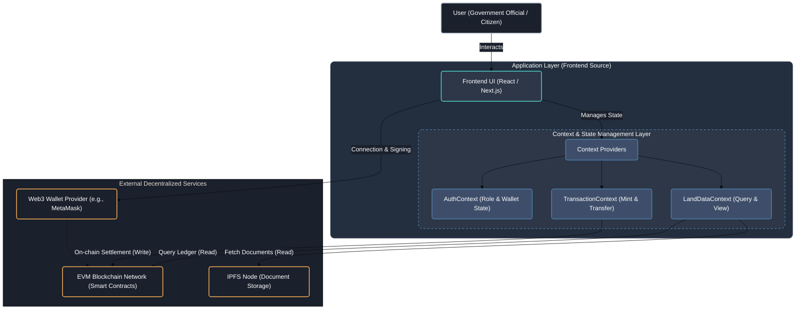

# GDG_Project :

# Secure Land Records Management System

## System Overview

This project is a decentralized application (dApp) designed to provide a secure, immutable, and transparent registry for rural land records. By leveraging Blockchain technology (EVM compatible) and InterPlanetary File System (IPFS), the system aims to prevent fraud, eliminate double-spending of land titles, and ensure verifiable ownership history without reliance on a single centralized authority.

## System Architecture

The following diagram illustrates the system's architecture, showing the flow of data between the user interface, the application's state management layer, and external decentralized services.

### Architectural Component Breakdown

1. **User & Wallet:** Users (Officials or Citizens) interact with the application through a Web3-injected browser extension like MetaMask, which handles cryptographic signing of transactions.
2. **Application Layer (Frontend):** Built with React.js or Next.js, this layer provides the user interface for registering land, viewing properties, and initiating transfers.
3. **Context Layer:** This internal layer manages the application's local state, handling user authentication status, fetching land data, and managing the lifecycle of blockchain transactions.
4. **External Services:**
* **EVM Blockchain:** Hosts the Solidity smart contracts that govern ownership rules, validation logic, and maintain the immutable ledger of land titles.
* **IPFS:** A peer-to-peer network used to store large deed documents, high-resolution maps, and images securely off-chain. Only the cryptographic hash (CID) of these documents is stored on the blockchain.

## Technical Requirements

To deploy and run this system effectively, the following technical stack is required.

### Software & Tools

* **Blockchain Network:** Ethereum (Sepolia/Goerli Testnet) or Polygon (Mumbai Testnet) for lower transaction costs.
* **Smart Contracts:** Solidity (v0.8.x or higher).
* **Development Framework:** Hardhat (recommended for testing and deployment scripts) or Truffle.
* **Frontend Framework:** React.js or Next.js.
* **Web3 Client Libraries:** Ethers.js or viem/wagmi for blockchain interaction.
* **Storage:** IPFS pinning service (e.g., Pinata) for reliable document handling.

### Functional Prerequisites

* **Browser:** A modern web browser (Chrome, Firefox, Brave) with a Web3 wallet extension installed.
* **Node.js:** Version 16.x LTS or higher installed on the host machine.

## Key Features

* **Immutable Records:** Once land data is written to the blockchain, it cannot be altered or deleted, providing a definitive source of truth.
* **Role-Based Access:** Smart contracts enforce permissions, ensuring only authorized Government Officials can mint new land tokens, while verified owners can initiate transfers.
* **Decentralized Storage:** Physical document digitization relies on IPFS, ensuring data availability even if centralized servers go down.
* **Transparent Audit Trail:** Every transaction, from initial registration to subsequent transfers, is publicly verifiable on the blockchain explorer.
